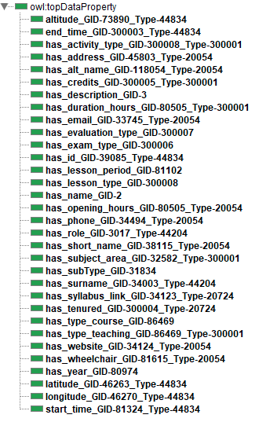

# DUniversity C+O+S

Official website for the Knowledge Graph Engineering course at the University of Trento for the academic year 2022/2023.

## Introduction

The University of Trento offers many courses and employs many people with different roles in different organizational units. The aim of this project is to create a knowledge graph to represent the courses, people and organizational units of the University. The methodology followed was iTelos, which can be explored by reading the following paper on [arXiv](https://arxiv.org/abs/2105.09418).

For more details about the project, it's recommended to read the report which can be found inside the repository on Github. Following are some excerpts from the report.

## Project repository

The repository for the project can be found at <https://github.com/bocchilorenzo/DUniversity-COS>.

## Purpose and domain

The previously presented aim can be described in form of a user request as follows:

> A service which helps the users to query and know about the different courses being taught at the University of Trento supported by its organizational structure.

The general scope of the project concerns the University of Trento, particularly the information about the courses taught, the staff/teachers and the organizational structure. As far as time is concerned, the scope is the current academic year. The spatial scope is represented by the University itself. Since it has multiple faculties and departments, it can be represented by the centroid of the coordinates of the various departments. Namely: latitude 46.0673894, longitude 11.1148277 and an average altitude of 272 meters.

## Reference ontologies

The existing ontologies that were used to extract the ETypes are:

- VIVO Core Ontology, which is suitable for the institutional organization in an academic setting
- Academic Institution Internal Structure Ontology, also particularly powerful for the organizational structure of an academic institution
- Semantic Web for Research Communities, containing useful classes concerning persons and their positions in a research or academic setting

## Datasets

The datasets used come from:

- [OPENdata Trentino](https://dati.trentino.it), an open data portal for the region of Trentino, where three dataset were found to be relevant for our purpose:
    
    - [Courses and degree programs offered by the University of Trento](https://dati.trentino.it/dataset/courses-and-degree-programs-offered-by-the-university-of-trento)
    - [Staff of the University of Trento](https://dati.trentino.it/dataset/staff-of-the-university-of-trento)
    - [Organizational units of the University of Trento](https://dati.trentino.it/dataset/organizational-units-of-the-university-of-trento)
- [Esse3](https://www.esse3.unitn.it/Root.do), which offres more in-depth information for the courses
- [OpenStreetMap](https://www.openstreetmap.org), which provides geospatial data on the varuous University facilities

## ETG

To create the ETG, the tools [Protégé](https://protege.stanford.edu/) and the iTelos KOS web app were used. Protégé was used to create the OWL/RDF file with all the classes, data properties and object properties. KOS was used to guide the process from the inception of the project to the language alignment of the teleontology. The ETG can be found at <https://github.com/bocchilorenzo/DUniversity-COS/blob/main/Teleologies/Formal%20Modeling/DUniversity%20COS-5v0-aligned_ontology_clean.owl>.

### Classes

### Data properties

### Object properties

## KG

To build the knowledge graph, the JSON datasets were mapped to the ETG with the help of [Karma](https://usc-isi-i2.github.io/karma/), which produced a series of Turtle file in output which were then imported in [GraphDB](https://graphdb.ontotext.com/).
The final datasets can be obtained at <https://github.com/bocchilorenzo/DUniversity-COS/tree/main/Datasets/Data%20Integration>.

### Example mapping
